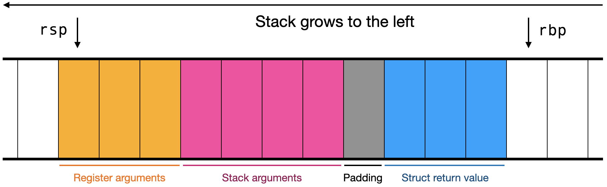

Assignment 11: ASM Functions
============================

Generate assembly for JPL functions and let bindings.

```diff
cmd : show <expr>
+   | let <lvalue> = <expr>
+   | fn <variable> ( <binding> , ... ) : <type> { ;
+         <stmt> ; ... ;
+     }

+stmt : let <lvalue> = <expr>
+     | return <expr>

+lvalue : <variable>
+       | <variable> [ <variable> , ... ]

+binding : <lvalue> : <type>

+type : int
+     | bool
+     | float
+     | <type> [ , ... ]

expr : <integer>
     | <float>
     | true
     | false
     | - <expr>
     | ! <expr>
     | <expr> + <expr>
     | <expr> - <expr>
     | <expr> * <expr>
     | <expr> / <expr>
     | <expr> % <expr>
     | <expr> < <expr>
     | <expr> > <expr>
     | <expr> == <expr>
     | <expr> != <expr>
     | <expr> <= <expr>
     | <expr> >= <expr>
     | [ <expr> , ... ]
```

#### Hints: Function Calls

The JPL calling convention is:

- Basic arguments are passed in general-purpose registers, in
  the following order: RDI, RSI, RDX, RCX, R8, R9
- Floating-point arguments are passed in vector registers, in the
  following order: XMM0 through XMM7
- Aggregate arguments, and any additional basic or floating-point
  arguments (if there are more than fit in the registers above),
  are passed on the stack. The stack arguments are always in order on the stack, meaning
  they have to be pushed in reverse order. When the function is
  called, the top of the stack must be the first stack-passed argument.
- Basic return values are passed in RAX
- Floating-point return values are passed in XMM0
- Aggregate return values are written to the stack. The caller must
  allocate space on the stack and pass the location of that stack
  space as the first basic argument.

**Basic arguments** are JPL `int`s and `bool`s and 64-bit signed
integers (`int64_t`), and strings (`char*`).
**Floating-point arguments** are JPL `float`s and
64-bit double-precision values (`double`) in the JPL runtime
functions.

Stacks must be 16-byte aligned when calling a function.

We allow all registers to be overwritten during calls, so your JPL compiler
doesn't need to save any registers across calls.

To call a function, do the following:

- Determine which arguments are passed on the stack and which are
  passed in which registers. Do the same for the return value.
- Allocate space for an array return value, if necessary
- Add padding to align the stack, if necessary
- Evaluate all stack arguments in reverse order, so they are on the
  stack in the correct order
- Evaluate all register arguments in reverse order, so they are on the
  top of the stack
- Pop all of the register arguments into the appropriate registers, so
  that the top of the stack is now the first stack-passed argument
- If necessary, put the address of the space allocated for an array return
  value in RDI
- Call the function

After the call, just before you start popping register arguments,
the stack should look like this:



JPL functions can access global variables (bound by let commands)
using offsets relative to `r12`, which points to the stack frame
of the `jpl_main` function.

> Note that R12 is a callee-saved register, so runtime functions will
> set it back to its original value before returning. R12 will always have
> the same value during the execution of your JPL code ... unless you decide
> to output code that clobbers R12.

The `jpl_main` function takes `args` and `argnum` as arguments, as if
it were defined like so:

```
fn jpl_main(args[argnum] : int[]) : void {
    ...
}
```

Before returning from a function, you need to drop all of the local
variables off the stack, via an `add rsp, N` instruction. If there
were no local variables, don't output this instruction.
(The staff compiler adds a comment to these instructions in its output.)


#### Hints: Let

A `let` statement/command first generates code for the right-hand expression
(the `e1` in `let x = e1`). The result will be the last value on the stack. Your
compiler must remember the stack offset of this result (offset from `rbp`)
to generate code for references to the bound variable.


# Testing your code

We will run your compiler with the `-s` flag:

    make run TEST=/grader/ok/001.jpl FLAGS=-s

The grader's `hw11/` folder has four directories:
- `ok1/` (Part 1): basic `let`
- `ok2/` (Part 2): function calls
- `ok3/` (Part 3): definitions
- `ok-fuzzer1/` (Part 4): valid auto-generated JPL programs
- `ok-fuzzer2/` (Part 5): valid auto-generated JPL programs

You can run these tests on your computer by downloading the
auto-grader and running it like so:

    make -C <auto-grader directory> DIR=<compiler directory> PART=<part> test-hw11

Since hw10 and hw11 are due the same day, we have a Makefile target to run both
at once. The autograder uses this command:

    make -C <auto-grader directory> DIR=<compiler directory> PART=<part> test-hw1011

# Submission and grading

This assignment is due Friday March 28.

We are happy to discuss problems and solutions with you on Discord, in
office hours, or by appointment.

| Weight | Function     |
|--------|--------------|
| 37%    | Part 1       |
| 35%    | Part 2       |
| 12%    | Part 3       |
|  8%    | Part 4       |
|  8%    | Part 5       |

