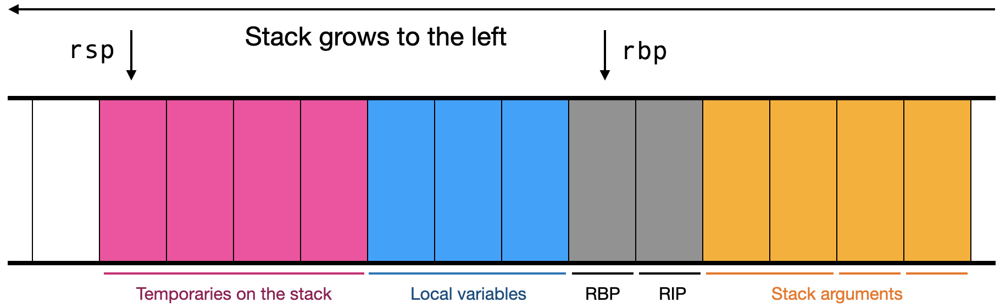

A *calling convention* describes how to call a function in assembly
code. Typically, it describes which arguments are passed in which
registers, and which arguments are passed on the stack, and also
various details like argument order, register saving, stack alignment,
and so on.

## Organizing your code generator

Continue to build on the code structure from the last assignment: an
`Assembly` object which contains multiple `Function` objects, where
each `Function` object contains codegen functions that take in an AST
node and a stack description, and return a list of assembly
instructions and a new stack description. (Or you might store the
stack description in a field of `Function`; that's fine too.)

The Stack class should contain an integer stack size and also
a hash table mapping local variable names to their
locations. For example, if you are compiling the command `let x = y`,
your `codegen_let_cmd` function should be passed a stack description where
`y` is mapped to some location like `rbp - 16`, and should output a
stack description where both `x` and `y` are mapped to some location.

It's sufficient to store the location as an integer offset to RBP.
Save the global stack description somewhere so you can look up global
variables as well; treat those offsets as relative to R12.

When a `Function` is asked to generate code for a `fn` command, it
should output no instructions, but it should ask the `Assembly` to
create a new `Function` object and generate code for the function body
inside *that* `Function`.

We recommend writing a `CallingConvention` class that stores
information about where the arguments and return values are stored for
a particular function call. The constructor for a `CallingConvention`
should take a list of `ResolvedType`s for the arguments and a
`ResolvedType` for the return value. A `CallingConvention` should
store a list of `Location`s for each argument and a `Location` for the
return value; a `Location` should be either a `RegisterValue` (which
should have a field indicating the register name) or a `StackValue`.
You'll use `CallingConvention`s both when calling and when defining
functions.

For example, to call a function with three arguments (of types `int`,
`{int, int[,,]}`, and `float`) and a return value of type `float[]`,
you'd create a `CallingConvention` like so:

    cc = CallingConvention([
      IntRType(),
      TupleRType([IntRType(), ArrayRType(IntRType(), 3)])
      FloatRType()
    ],
      ArrayRType(FloatRType(), 1))

Use fields to indicate where the arguments go:

    >>> cc.ret
    StackValue()
    >>> cc.args
    [ RegisterValue("rsi")
    , StackValue()
    , RegisterValue("xmm0") ]

## Stack for Let

Prof. Pavel drew this picture of a stack for let commands/statements.
Prof. Ben thinks this picture is useless but is including it here just in case
it helps.

## Stages of function support

Here is one way to work toward correct stacks:

First, work on `let` commands. You'll need to implement
storage for the offsets of function arguments. You'll
also need to write Stack helpers `add_argument` and `add_lvalue` to handle complex
arguments; these will be similar to the same-named functions in your
type checker.

Second, add support for function calls. There should be plenty of
built-in functions to call. At this stage you would write the
`CallingConvention` class, though because the builtin functions don't
take aggregate arguments, you don't need to support that yet. Make
sure to test nested function calls like `sin(atan2(1.0, 2.0))`.

Finally, add support for function definitions. You'll need to improve
`CallingConvention` to handle of aggregate arguments and also
arguments with too many integer or floating-point arguments, because
user-defined functions can have any number of arguments in JPL. You
can use the `FunctionInfo` in the global symbol table to look up the
types of each argument.

When the return value is an aggregate type (array or tuple), we
recommend saving its location to the `StackDescription`, perhaps as
the location of a variable named `$return` or similar. (Note that this
is not a valid JPL variable name, so you're guaranteed it won't be
overwritten by a user variable). You'll also need to implement code
generation for the `let` and `return` statements. `let` is identical
to the `let` commands, but the `return` statement is new. Make sure to
add an implicit returns at the end of any void function that doesn't
have an explicit `return` command.

