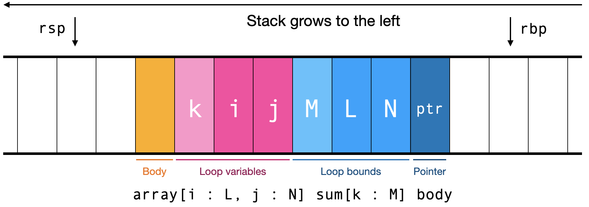

# Step 1: Detecting tensor contractions

To identify tensor contractions, add some boolean flags to your
`Expr` class:

- `is_tc`, which will indicate if an expression matches the `tc` class
- `is_tc_sum`, which will indicate if an expression matches the
  `tc_sum` class
- `is_tc_body`, which will indicate if an expression matches the
  `tc_body` class
- `is_tc_primitive`, which will indicate if an expression matches the
  `tc_primitive` class

Initialize all these fields to `false`.

Create an Visitor for AST nodes called `TensorContraction` to set these
boolean flags. For example, your `visit_int_expr`, `visit_float_expr`, and
`visit_var_expr` methods should set `is_tc_primitive` and `is_tc_body`; your
`visit_binop_expr` and `visit_array_index_expr` methods should set
`is_tc_body`; and so on.

Note that, when setting `tc` and `tc_sum`, you need to check that the
loop bounds are integers. You should also allow them to be expression
that constant-propagate to an integer. For this to work, you'll need
to make sure to run the `TensorContraction` after you run the
`ConstantPropagation`.

To debug this step, we recommend adding a print statement in all of
the `TensorContraction` methods that set the various fields. Once it
works, you should be able to detect 1 tensor contraction in each of
the five benchmarks. That tensor contraction should come from the last
line of each benchmark.

# Step 2: Building the traversal graph

The staff compiler prints the list of nodes and edges as a comment in the
assembly code. Use this info to debug your lists of nodes and edges.

Here are the node and edge counts for the 5 test programs:

| Benchmark | Nodes | Edges |
|-----------|-------|-------|
| `col`     | 2     | 1     |
| `crs`     | 3     | 3     |
| `mat`     | 3     | 3     |
| `sft`     | 3     | 3     |
| `dns`     | 4     | 6     |

# Step 3: Computing the topological order

For example, consider the matrix multiply traversal graph, which has
three nodes (`i`, `j`, `k`) and three edges ((`i`, `j`), (`i`, `k`),
and (`k`, `j`)):

- The topological order starts empty
- `i` isn't the target of any edge, so add it; the topological order
  is now `i`, the nodes are now `j` and `k`, and the edges are now
  `k`, `j` (because the other two edges had `i` as a source and were
  removed)
- `j` is the target of an edge, so it doesn't work
- `k` isn't the target of any edge, so add it; the topological order
  is now `i`, `k`, the nodes are now just `j`, and there are now no
  edges
- Now, `j` is not the target of any edge, so add it; the topological
  order is now `i`, `k`, `j` and the loop is done

This algorithm is O(V^2 E), since it has three nested loops. In our
case, E can be as large as V^2, so overall this algorithm is O(V^4).
This definitely isn't ideal, but would really only become a problem
once you had hundreds of variables, and hundred-dimensional tensors
are rare. Our benchmarks have four variables at most. There are
faster, O(E) algorithms for topological sort. Those algorithms are
variations of this one, but use hash tables to avoid having to
traverse the list of variables repeatedly.

We recommend debugging this step by printing the topological order,
the list of nodes, and the list of edges at every iteration of the
outer loop. All of the graphs we will be compiling are pretty small,
so it should be easy to work out by hand what went wrong. Here are the
initial orders and topological orders for each benchmark; these can
also be found in a comment in the generated assembly code:

| Benchmark | Initial Order | Topological Order |
|-----------|---------------|-------------------|
| `col`     | j, i          | i, j              |
| `crs`     | i, k, j       | i, j, k           |
| `mat`     | i, j, k       | i, k, j           |
| `sft`     | n, i, j       | i, j, n           |
| `dns`     | i, j, i2, j2  | i2, j2, i, j      |

Once you've constructed the topological order, save it on a new field
of `ArrayLoopExpr`s, perhaps called `tc_order`.

# Step 4: Generate loop code

The stack for a tensor contraction does not depend on the topological
sort, and should look like this:

Going right to left, we have the array pointer, then the
loop bounds (array bounds first, then sum bounds), then the loop
indices (array indices first, then sum indices), and then the body on
top of that.

There isn't a running sum for the `sum` loop, because that running sum
will be stored directly in the array produced by the `array` loop.

